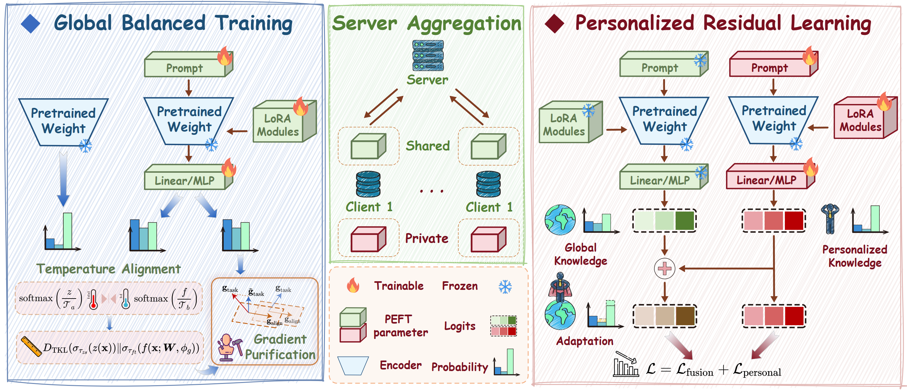

# Fine-Tuning Impairs the Balancedness of Foundation Models in Long-Tailed Personalized Federated Learning

**CVPR 2026** | [Paper]()

<p align="center">
  
</p>

## 📖 Abstract

Personalized federated learning (PFL) with foundation models has emerged as a promising paradigm enabling clients to adapt to heterogeneous data distributions. However, real-world scenarios often face the co-occurrence of non-IID data and long-tailed class distributions, presenting unique challenges that remain underexplored in PFL. In this paper, we investigate this long-tailed personalized federated learning and observe that current methods suffer from two limitations: (i) Fine-tuning degrades performance below zero-shot baselines due to the erosion of inherent class balance in foundation models; (ii) Conventional personalization techniques further transfer this bias to local models through parameter or feature-level fusion. To address these challenges, we propose **Fed**erated Learning via Gradient **Pu**rification and **Re**sidual **L**earning (**FedPuReL**), which preserves balanced knowledge in the global model while enabling unbiased personalization. Specifically, we purify local gradients using zero-shot predictions to maintain a class-balanced global model, and model personalization as residual corrections atop the frozen global model. Extensive experiments demonstrate that FedPuReL consistently outperforms state-of-the-art methods, achieving superior performance on both global and personalized models across diverse long-tailed scenarios.

## 📦 Requirements

- Python 3.8+
- PyTorch 1.10.0+

```bash
pip install -r requirements.txt
```

## 📊 Datasets

| Dataset | Classes | Type |
|:--|:--:|:--|
| CIFAR-100-LT | 100 | General |
| ImageNet-LT | 1000 | Large-scale |
| Places-LT | 365 | Scene |
| Food101-LT | 101 | Fine-grained |
| DTD-LT | 47 | Texture |
| FGVC-Aircraft-LT | 100 | Fine-grained |
| Stanford Dogs-LT | 120 | Fine-grained |
| OxfordPets-LT | 37 | Fine-grained |

## 🚀 Quick Start

```bash
# CIFAR-100-LT with prompt tuning (default)
bash scripts/cifar100.sh

# CIFAR-100-LT with LoRA
bash scripts/cifar100.sh lora

# CIFAR-100-LT with adapter
bash scripts/cifar100.sh adapter
```

## ⚙️ Key Hyperparameters

| Parameter | Default | Description |
|:--|:--:|:--|
| `NUM_USERS` | 20 | Number of clients |
| `FRAC` | 0.4 | Client participation ratio per round |
| `ROUNDS` | 100 | Communication rounds |
| `IMB_FACTOR` | 0.01 | Imbalance factor (IF=100) |
| `BETA` | 1.0 | Dirichlet concentration parameter |
| `N_CTX` | 4 | Prompt length (prompt-based) |
| `LORA_RANK` | 8 | LoRA rank (LoRA-based) |
| `FUSION_LOSS_ALPHA` | 0.99 | Fusion loss weight λ |
| `LR` | 0.001 | Learning rate (SGD) |

Results are saved to `output/`.

## 📌 Citation

```bibtex
@inproceedings{hou2026fine,
  title={Fine-Tuning Impairs the Balancedness of Foundation Models in Long-Tailed Personalized Federated Learning},
  author={Hou, Shihao and Shang, Chikai and Yang, Zhiheng and Yang, Jiacheng and Shang, Xinyi and Gao, Junlong and Zhang, Yiqun and Lu, Yang},
  booktitle={Proceedings of the IEEE/CVF Conference on Computer Vision and Pattern Recognition (CVPR)},
  year={2026}
}
```

## 🙏 Acknowledgement

This repository is built upon [PromptFL](https://github.com/PEILab-Federated-Learning/PromptFL), [CLIP-LoRA](https://github.com/MaxZanella/CLIP-LoRA), and [PersonalizedFL](https://github.com/microsoft/PersonalizedFL). We thank the authors for their excellent codebases.
